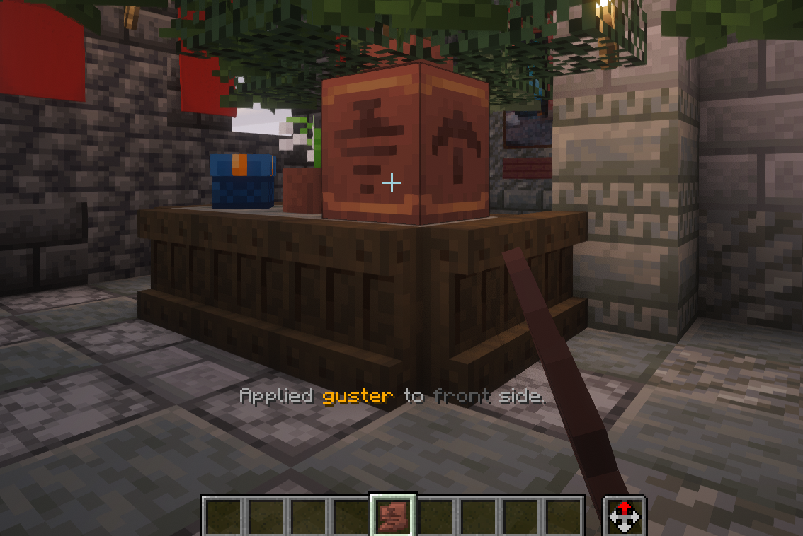

# PimpMyPot

**Version:** 1.0-SNAPSHOT | **Minecraft:** 1.21+ | **Author:** LordFinn  

---

## Description

PimpMyPot lets you **decorate Decorated Pots** in Minecraft with pottery sherds!  
Click a pot with a sherd to apply it to the side you clicked. In **Survival**, old sherds are returned; in **Creative**, decorations are unlimited.

---

## Features

- Apply sherds to **front, back, left, or right** sides of pots.  
- **Survival-safe:** consumes sherds, refunds old ones, drops on full inventory.  
- **Creative-friendly:** unlimited decorating.  
- **Subtle action bar feedback** for immersive notifications.  

---

## How to Use

1. Hold a pottery sherd.  
2. Right-click a Decorated Pot on the side you want to decorate.  
3. Watch your pot transform!  

---

## Installation

1. Download `PimpMyPot.jar`.  
2. Place it in your server `plugins` folder.  
3. Restart the server and enjoy!

---

*Add life and personality to your Minecraft pots with PimpMyPot!*
